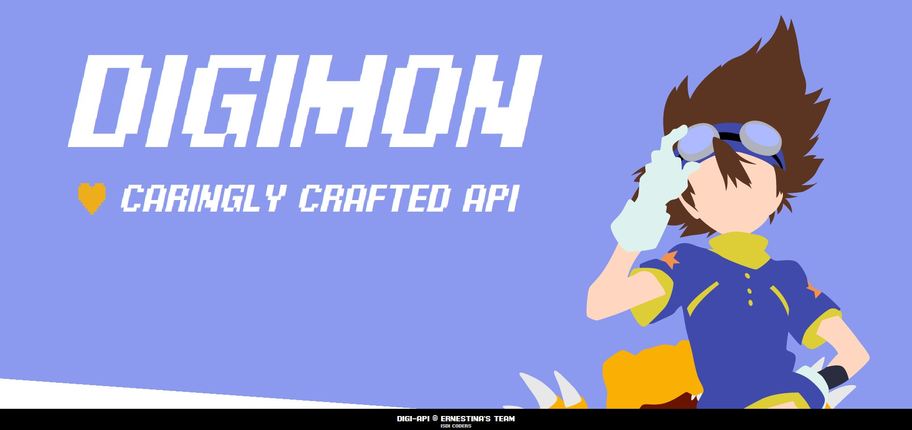

# Week 5 | Proyecto en equipo

## Grupo **Ernestina** | Digi-API

 

**_Digi-API_** es una APP que recopila un total de 1400 digimons. El usuario podrá visualizar todos los digimons y sus ID, organizados en grupos de 20 y siguiendo una paginación estructurada.

A su vez, si el usuario realiza un _click_ en cualquier digimon, accederá a la página de _Details_ donde se le enseñará su nombre (_NAME_), su descripción (_DESCRIPTION_), su fecha de lanzamiento (_RELEASE DATE_), su atributo (_ATTRIBUTE_) y su nivel (_LEVEL_).

### **Es un proyecto SPA con varias 'páginas' en _React_, gestionando el estado común con _context_ + _reducer_ (_useReducer_). Se utiliza _scss_, _css-module_ y la app es _responsive_ (mobile + desktop) / mobile first.**

 
 

## Link al despliegue de la aplicación en Vercel:

https://ernestina-202304-mad.vercel.app/

 
 

# Índice

1. [Título, nombre del grupo y descripción del proyecto](#week-5--proyecto-en-equipo)

2. [Link al despliegue de la aplicación en *Vercel*](#link-al-despliegue-de-la-aplicación-en-vercel)

3. [Scripts](#scripts)

4. [Estado del proyecto](#estado-del-proyecto)

5. [Instrucciones del proyecto en grupos](#instrucciones-del-proyecto-en-grupos)

6. [Listado de componentes](#listado-de-componentes)

7. [Tecnologías utilizadas](#tecnologías-utilizadas)

8. [Desarrolladores del proyecto](#desarrolladores-del-proyecto)

 
 

## Scripts

`npm run dev`: starts a development server

`npm run build`: builds the app

`npm run preview`: runs the built app

 
 

## Estado del proyecto

 

 
 

## Instrucciones del proyecto en grupos

Tenéis que crear una SPA con varias 'páginas' en React, gestionando el estado común con context + reducer (useReducer). Usaremos scss + css-module y la app debe ser responsive (mobile + desktop) / mobile first.

Mínimo de páginas (vistas):

- Lista API pública,
- Lista API privada
- Detail
- Crear ítem
- Modificar ítem
- Página no encontrada

- Alguna/s de ellas se tiene que cargar mediante lazy loading.

La app se conectará a una **API pública** de vuestra elección y listará los elementos. En dicho listado tiene que haber paginación y también un filtro como mínimo. Filtrado en la misma página del listado. Al filtrar, no dirigimos al usuario a otra página, se queda en el listado y el listado cambia.

A partir de este listado tendréis que crear otro listado conectado a una **API privada** (API local mediante JSON-server), donde implementaréis CRUD.

- La creación y edición de item se hará con el mismo componente formulario reutilizado. La creación y la edición tienen que tener paths distintos en la URL. Cuando el usuario crea o edita, se le tiene que redirigir al listado y dar un feedback del resultado de la operación.
- El botón de borrar tiene que estar en el mismo listado de items. Cuando el usuario borra, no se va a otra página, en el mismo listado en el que está debe desaparecer el ítem. También si queréis puede estar en la página de detalle.

La interfaz debe dar feedback de cuando se está esperando una response de las APIs, y también debe gestionar los errores de éstas.

Requisitos:

- Diseño en Figma
- Listado de componentes y responsabilidades
- Trello:

  - Columnas Backlog, ToDo (Day/Sprint), In progress, Testing, Review/Que hice ayer y Done

- Hacer daily:

  - Qué tareas hice ayer
  - Qué stoppers tuve
  - Qué tareas haré hoy

- Hooks de git (huskies) y GitHub Actions
- SonarCloud, mínimo de un escaneo diario
- Mínimo de un approvals para poder mergear PR
- Desplegada a Netlify / Vercel

- HTML semántico (validado)
- CSS con module-css (validado)
- Testing con coverage. Todos los tipos de tests que hemos visto.
- Optimizada (Lighthouse en Netlify / Vercel)

## Challenge WeekEnd

- Seleccionar
  - API: probarla -> consistencia / rendimiento / no pago
- Diseño en Figma
- Listado de componentes y responsabilidades
- Trello:
  - Columnas Backlog, ToDo, In progress, Review/Testing y Done

Entregamos en Discord:

- Nombre y url API
- Link Figma
- Link Trello
- Link Listado componentes

 
 

## Listado de componentes

https://www.notion.so/202304-w5-isdi-coders/API-Digimon-26fc7622ac1c4150aa460b4f88dfd002

 
 

## Tecnologías utilizadas

- React
- TypeScript
- JavaScript
- JEST
- Sass
- Vite

 
 

## Desarrolladores del proyecto

| [ Raquel Adrados](https://github.com/raqueladrados) | [ Sergio Mata](https://github.com/inviolableviolets) | [ Kevin Schans](https://github.com/KevinVanDerSchans) |
| :------------------------------------------------------------------------------------------------------------------------------------------: | :-------------------------------------------------------------------------------------------------------------------------------------------: | :--------------------------------------------------------------------------------------------------------------------------------------------: |

 

[def]: https://img.shields.io/badge/coverage-100%-green
